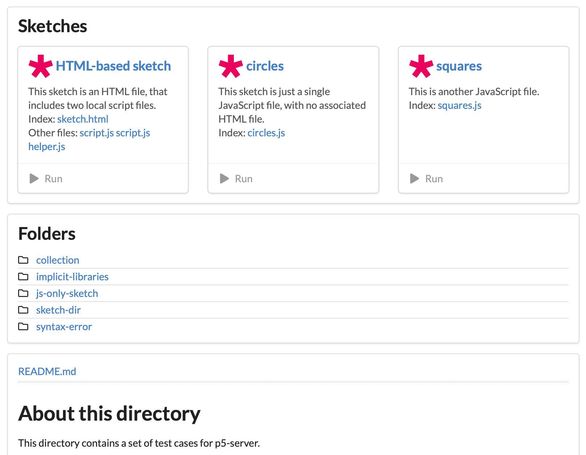
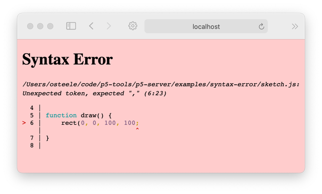
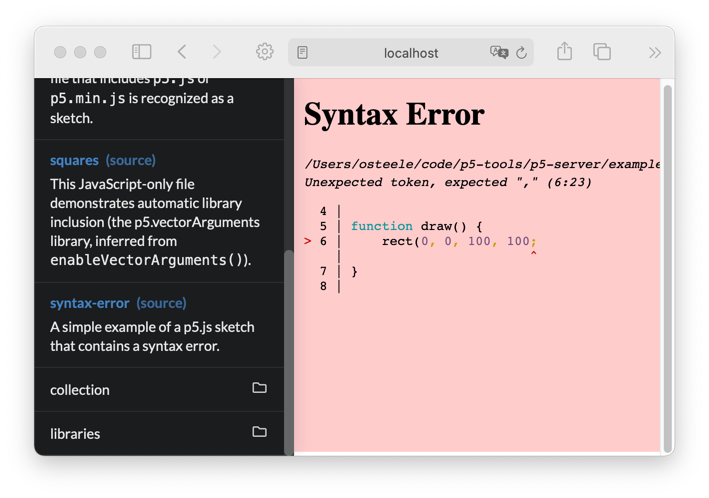

# P5.js Server

[](https://www.npmjs.com/package/p5-server)
<!-- [](https://github.com/osteele/p5-server/actions/workflows/ci.yml) -->

<!-- @import "[TOC]" {cmd="toc" depthFrom=2 depthTo=6 orderedList=false} -->

<!-- code_chunk_output -->

- [P5.js Server](#p5js-server)
  - [Overview](#overview)
  - [Features](#features)
  - [Quick Start – Installation](#quick-start--installation)
  - [Quick Start – Usage](#quick-start--usage)
  - [Recipes](#recipes)
    - [Run the Server](#run-the-server)
      - [Serve a directory inside the current directory](#serve-a-directory-inside-the-current-directory)
      - [Open the browser automatically](#open-the-browser-automatically)
      - [Browse directories in split mode](#browse-directories-in-split-mode)
      - [Create a sketch file](#create-a-sketch-file)
    - [Build a static site](#build-a-static-site)
    - [Convert between JavaScript-only and HTML sketches](#convert-between-javascript-only-and-html-sketches)
  - [Command-Line Reference](#command-line-reference)
    - [`p5 build [DIRECTORY]`](#p5-build-directory)
    - [`p5 convert FILENAME --to FORMAT`](#p5-convert-filename---to-format)
    - [`p5 create [NAME]`](#p5-create-name)
    - [`p5 serve [filename]`](#p5-serve-filename)
    - [`p5 tree [DIRECTORY]`](#p5-tree-directory)
  - [Implementation Notes](#implementation-notes)
  - [Limitations](#limitations)
  - [API](#api)
  - [Acknowledgements](#acknowledgements)
  - [Other Work](#other-work)
  - [Keeping in Touch](#keeping-in-touch)
  - [License](#license)

<!-- /code_chunk_output -->

## Overview

**p5-server** is a command-line interface for [p5.js](https://p5js.org/). It
provides a web server with live reload, that knows how to serve JavaScript-only
sketches and to figure out which libraries a sketch needs in order to run.



You can use it develop sketches, or to browse a collection of sketches in a
directory.

[](https://images.osteele.com/p5-server/explore-fullsize.gif)

p5-server can also be used to create a set of HTML pages that present a
collection of sketches. The [examples
page](https://osteele.github.io/p5.libs/p5.vector-arguments/examples) of the
[p5.vectorArguments](https://osteele.github.io/p5.libs/p5.vector-arguments)
documentation demonstrates this.

The web server, library inference, and sketch generation features are also
available as a [Visual Studio Code
extension](https://github.com/osteele/vscode-p5server#readme), and via a
[programmatic
API](https://github.com/osteele/p5-server/tree/master/p5-analysis#readme).

## Features

- ***Live reload***. The browser reloads the page when the source is
  modified.
- ***JavaScript-only sketches***. A sketch can be a single JavaScript file. You
  don't need to create an HTML file just to run the sketch.
- ***Automatic library includes***. If a JavaScript-only sketch uses a function
  from a [p5.js library](https://p5js.org/libraries/), the library will be
  included. ([This
  page](https://github.com/osteele/p5-server/tree/master/p5-analysis#automatic-library-inclusion)
  describes how this works.)
- ***In-browser syntax errors***. A JavaScript file that has a syntax error will
  display the error in the browser. Edit and save the file to reload the page.

    
    
- ***Sketch-aware directory listings***. Viewing a directory in the browser
  lists the sketches, folders, other files in that directory.
- ***Sketch file generation***. `p5 generate` creates a sketch file that you can
  use to get started.

## Quick Start – Installation

These commands install the `p5` command on your computer. You only need to do
them once.

Text shown in `monospace` should be entered into a terminal.

1. `node --version`

   This tests whether Node.js is installed on your system. It should print
   something like `v16.9.0`. (The exact number doesn't matter; you just want it
   not to report an error such as "command not found".)

   If Node.js is *not* installed, install it from [here](https://nodejs.org/).
   It doesn't matter whether you install the LTS or Current version of node.

2. `npm install -g p5-server`

    This installs the `p5` command on your computer.

    Once this is done, you can enter commands such as `p5 create` and `p5
    serve`, or just `p5` to see a list of all the commands.

## Quick Start – Usage

1. `p5 create my-sketch`

    This creates a sketch named `my-sketch.js` in the current directory.

    If you already have some sketches on your file system, you can skip this
    step. Instead, use the `cd` command to change the terminal's current
    directory to a directory that contains some sketches.

2. `p5 serve --open`

   This starts the server, and opens your sketch directory in the browser.

   Click on a sketch in the browser page to run it.

3. Use a code editor (such as [Atom](https://atom.io), [Visual Studio
   Code](https://code.visualstudio.com), vim, or emacs) to edit the
   `my-sketch.js` file that you created in step 1. Each time you save the file,
   the browser will reload the page and re-run your sketch.

## Recipes

### Run the Server

`p5 server`

Starts a web server that knows about p5.js sketches, and that reloads
sketches when files are changed. The server is set to serve files from the
current directory.

#### Serve a directory inside the current directory

`p5 server PATH`

Starts a server that serves files from the directory at *PATH*.

#### Open the browser automatically

`p5 server --open`

Starts the server, and opens the directory in the default browser.

#### Browse directories in split mode

`p5 server --split`

Displays directory listings with the sketch in the same window (inside of an
[iframe](https://developer.mozilla.org/en-US/docs/Web/HTML/Element/iframe)), as
shown in the screen shot above.

You can combine options, e.g. `p5 server examples --open --split`.

#### Create a sketch file

- `p5 create` creates a JavaScript sketch file named `sketch.js` in the current
directory.

  This is a **JavaScript-only sketch**. The server can run this sketch, or you
  can paste it into online editors such as the [P5 web
  editor](https://editor.p5js.org) and
  [OpenProcessing.org](https://openprocessing.org).

- `p5 create my-sketch.js` creates a JavaScript sketch file named
  `my-sketch.js`.

- `p5 create my-sketch.html` creates an HTML file named `my-sketch.html` and a
  JavaScript file named `my-sketch.js`.

- `p5 create my-sketch` creates a folder named `my-sketch`, and creates
  `index.html` and `sketch.js` files inside this folder.

The default generated script contains `setup()` and `draw()` functions. The
`setup()` functions creates a canvas, and the `draw()` functions draws circles
that follow the mouse. `--options` can be used to customize this script.
See the reference, below.

### Build a static site

`p5 build SOURCES` builds a static site into `./build`.

Run `p5 build --help` for a list of options.

Two themes are supported, `--theme directory` and `--theme split`.

### Convert between JavaScript-only and HTML sketches

`p5 convert sketch.html` converts an HTML sketch to a JavaScript-only sketch, by
deleting the HTML file. It first inspects this file, to insure that the sketch
contains only a single script file, and that all the information necessary to
run the sketch is in the script.

`p5 convert sketch.js` creates an HTML file that can be used to run the sketch.

## Command-Line Reference

Run `p5 --help` to see a list of commands.

Run `p5 <command> --help` to see command-line options for a particular command.

### `p5 build [DIRECTORY]`

- `p5 build` creates an HTML index for a collection of sketches.
- `p5 build -o out` places the index in the `./out` directory.   (The default is
  `./build`.)

### `p5 convert FILENAME --to FORMAT`

> Converts between HTML and JavaScript-only sketches.

- `p5 convert FILENAME --to html` creates an HTML file that uses the `<script>`
  tag to include the JavaScript sketch.
- `p5 convert FILENAME --to javascript` removes an HTML file, leaving only the JavaScript file.

Converting a JavaScript-only sketch is simple. An HTML file with the same base
name is created, that includes the script, the p5.js source (from a CDN), and
any inferred libraries. This will fail if the directory already contains a
HTML file with this name.

Converting an HTML sketch to a JavaScript-only sketch involves deleting the HTML file that
includes the script. This potentially looses some information. Before the file is deleted,
the following checks are made:

- The HTML file includes only a single script file.
- The libraries that the HTML file includes (via `<script>` tags) are the same
  as the libraries that will be inferred from the script file, based on the
  classes and functions that the script file uses and does not define.

### `p5 create [NAME]`

> Create a JavaScript-only sketch; or an HTML file and a JavaScript file.

- `p5 create` – creates `sketch.js`
- `p5 create my-sketch.js` – creates just the JavaScript file
- `p5 create my-sketch.html` – creates `my-sketch.html` and `my-sketch.js`
- `p5 create my-sketch --type folder` – creates a folder named `my-sketch`, that
  contains files `index.html` and `sketch.js`.

`p5 create --options comments,preload` specifies a comma-separated set of
template options. The options are:

- `comments` – include comments (e.g. `// put setup code here`) inside the
  functions
- `preload` – include an (empty) `preload()` function
- `windowResized` – include a `windowResized()` function, that resizes the
  canvas when the window is resized
- `no-draw` – omit the `draw()` function, in order to create a "static" sketch
- `no-examples` – omit the example call inside of `draw()`

### `p5 serve [filename]`

> Runs a web server that knows about p5.js sketches.

or the `filename` subdirectory of the current directory.

`p5 serve filename` runs a sketch in the browser.

- If `filename` is an HTML file (for example, `index.html`), this command serves
  that page.
- If `filename` is a JavaScript file that contains a p5.js sketch (for example,
  `sketch.js`), the server serves a page that runs the sketch.
- If `filename` is a directory, the browser displays a list of sketches and files in that directory.
- If `filename` is not supplied, the browser displays sketches and files in the
  current directory. (This is the same as `p5 serve .`.)

By default, the server runs on port 3000. You can open it in a browser by
visiting <http://localhost:3000>. The `p5 server --open` will do this
automatically.

If another server is already running on port 3000, the server will choose
another port.

### `p5 tree [DIRECTORY]`

> Display the contents of *DIRECTORY*, organized by sketch.

```text
$ yarn cli tree examples
📁examples
├── 🎨circles (circles.js)
├── 🎨sketch
│   ├── sketch.html
│   ├── main.js
│   └── helper.js
├── 🎨sketch-dir
│   ├── index.html
│   └── sketch.js
├── 🎨squares (squares.js)
├── 🎨syntax-error
│   ├── index.html
│   └── sketch.js
├── 📁collection
│   ├── 🎨sketch 1 (sketch-1.js)
│   ├── 🎨sketch 2 (sketch-2.js)
│   └── README.md
├── 📁libraries
│   ├── 🎨dat.gui (dat.gui.js)
│   ├── 🎨layers (layers.js)
│   ├── 🎨posenet (posenet.js)
│   ├── 🎨sound
│   │   ├── sound.js
│   │   └── doorbell.mp3
│   ├── 🎨sound pulse (sound-pulse.js)
│   ├── 🎨vector arguments (vector-arguments.js)
│   └── README.md
└── README.md
```

This is similar to what the Sketch Explorer view in the [Visual Studio Code
extension](https://github.com/osteele/vscode-p5server#readme) displays.

## Implementation Notes

The [p5-analysis implementation
notes](./p5-analysis/README.md#implementation-notes) describe sketch detection,
automatic library inclusion, and other details of the implementation.

## Limitations

- This code hasn't been tested on Windows.
- Generated sketches require an internet connection to run. They load the p5.js
  and other libraries from a content delivery network (“CDN”). Browsers cache
  these files, so reloading a page or running other sketches that use the same
  (or no) libraries do not require additional internet access, but you will need
  internet access the first time you use this extension or after the browser
  cache has expired.
- The server requires an internet connection in order to display sketches and
  directory listings. (It loads the Semantic UI CSS framework from a CDN.)
- This code hasn't been tested with
  [instance-mode](https://github.com/processing/p5.js/wiki/Global-and-instance-mode)
  sketches.
- Library inference hasn't been tested with sketches that are written as
  [modules](https://developer.mozilla.org/en-US/docs/Web/JavaScript/Guide/Modules).
- See the [p5-analysis implementation
  notes](./p5-analysis/README.md#implementation-notes) notes for limitations on
  the recognition of associated files.

## API

The server can be invoked programmatically. See the [API Reference](https://osteele.github.io/p5-server/p5-analysis/) for installation instructions and reference documentation for this use.

## Acknowledgements

This project builds on these libraries and frameworks:

- commander, chalk, and update-notifier for command-line-y stuff
- esprima and node-html-parser for parsing JavaScript and HTML, respectively
- expressjs for the web server
- livereload for the live reload functionality
- marked for converting Markdown to HTML
- nunjucks and pug for template generation
- The Semantic UI CSS framework
- And of course [p5.js]([https](https://p5js.org/)

## Other Work

[https://code.osteele.com](https://code.osteele.com#p5-js) lists my other p5.js
projects. These include tools, libraries, and examples and educational
materials.

## Keeping in Touch

Report bugs, features requests, and suggestions
[here](https://github.com/osteele/p5-server/issues), or message me [on
Twitter](https://twitter.com/osteele).

Follow [@osteele on Twitter](https://twitter.com/osteele) for updates.

## License

[MIT](LICENSE) © by Oliver Steele
