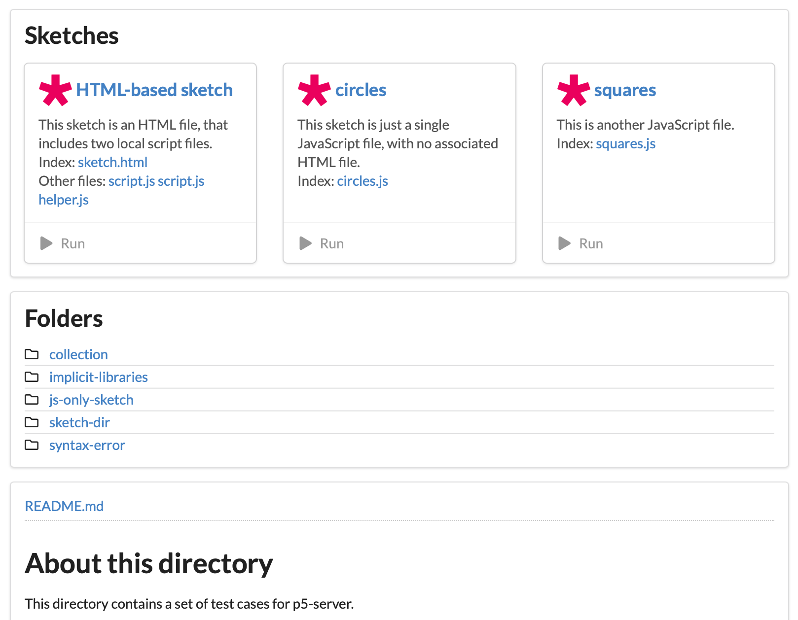
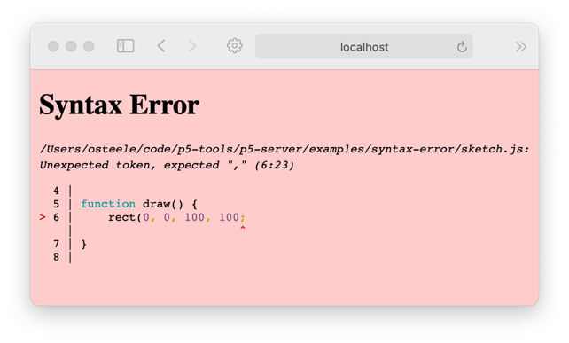
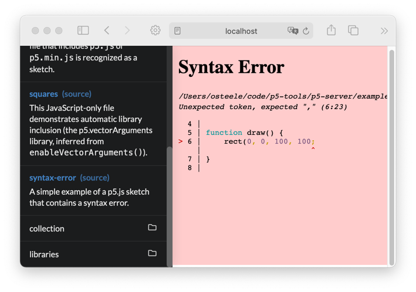

# P5.js Server

[](https://www.npmjs.com/package/p5-server)
[](https://github.com/osteele/p5-server/actions/workflows/ci.yml)

- [Overview](#overview)
- [Features](#features)
- [Quick Start – Installation](#quick-start--installation)
- [Quick Start – Usage](#quick-start--usage)
- [Recipes](#recipes)
  - [Run the Server](#run-the-server)
    - [Serve a directory inside the current directory](#serve-a-directory-inside-the-current-directory)
    - [Open the browser automatically](#open-the-browser-automatically)
    - [Browse directories in split mode](#browse-directories-in-split-mode)
    - [Create a sketch file](#create-a-sketch-file)
  - [Build a static site](#build-a-static-site)
  - [Create a screenshot](#create-a-screenshot)
  - [Convert between JavaScript-only and HTML sketches](#convert-between-javascript-only-and-html-sketches)
- [Command-Line Reference](#command-line-reference)
  - [`p5 build [DIRECTORY]`](#p5-build-directory)
  - [`p5 convert FILENAME --to FORMAT`](#p5-convert-filename---to-format)
  - [`p5 create [NAME]`](#p5-create-name)
  - [`p5 serve [filename]`](#p5-serve-filename)
  - [`p5 screenshot [filename]`](#p5-screenshot-filename)
  - [`p5 tree [DIRECTORY]`](#p5-tree-directory)
  - [Additional commands](#additional-commands)
- [Implementation Notes](#implementation-notes)
- [Limitations](#limitations)
- [API](#api)
- [Development](#development)
- [Acknowledgements](#acknowledgements)
- [Other Work](#other-work)
- [Keeping in Touch](#keeping-in-touch)
- [License](#license)

## Overview

**p5-server** is a development server for [p5.js](https://p5js.org/). It
provides a web server with live reload, and command-line tools to generate HTML
and JavaScript templates. The server can serve JavaScript-only sketches (that do
not require an HTML file); it figures out which libraries a sketch needs in
order to run.



p5-server can be used to develop sketches; or to browse a collection of sketches
in a directory.

[](https://images.osteele.com/p5-server/explore-fullsize.gif)

p5-server can also be used to create a set of HTML pages that present a
collection of sketches. The [examples
page](https://osteele.github.io/p5.libs/p5.vector-arguments/examples) of the
[p5.vectorArguments](https://osteele.github.io/p5.libs/p5.vector-arguments)
documentation demonstrates this.

The web server, automatic library inclusion, and sketch generation features are
also available as a [Visual Studio Code
extension](https://github.com/osteele/vscode-p5server#readme), and via a
[programmatic
API](https://github.com/osteele/p5-server/tree/main/p5-analysis#readme).

## Features

- ***Live reload***. The browser reloads the page when the source is
  modified.
- ***JavaScript-only sketches***. A sketch can be a single JavaScript file. You
  don't need to create an HTML file just to run the sketch.
- ***Automatic includes***. If a JavaScript-only sketch uses a function
  from [one of these
  libraries](https://osteele.github.io/p5-server/p5-analysis/libraries), the
  library will be included. ([This
  page](https://github.com/osteele/p5-server/tree/main/p5-analysis#automatic-library-inclusion)
  describes how this works.)
- ***In-browser syntax errors***. A JavaScript file that has a syntax error will
  display the error in the browser. Edit and save the file to reload the page.

    
    
- ***Sketch-aware directory listings***. Viewing a directory in the browser
  lists the sketches, folders, other files in that directory.
- ***Sketch file generation***. `p5 create` creates a sketch file that you can
  use to get started.
- **Integrated web accelerator (CDN Cache)**. The server proxies requests to the
  common content delivery networks (CDNs) that are used to deliver the sources
  to p5.js and common p5.js libraries. See [here](./docs/proxy-cache.md) for
  more information about how this works.

## Quick Start – Installation

These commands install the `p5` command on your computer. You only need to do
them once.

Text shown in `monospace` should be entered into a terminal.

1. `node --version`

   This tests whether Node.js is installed on your system. It should print
   `v20.0.0` or newer.

   If Node.js is *not* installed, install it from [here](https://nodejs.org/).
   The current LTS release is recommended.

2. `npm install -g p5-server`

    This installs the `p5` command on your computer.

    Once this is done, you can enter commands such as `p5 create` and `p5
    serve`, or just `p5` to see a list of all the commands.

## Quick Start – Usage

1. `p5 create my-sketch`

    This creates a sketch named `my-sketch.js` in the current directory.

    If you already have some sketches on your file system, you can skip this
    step. Instead, use the `cd` command to change the terminal's current
    directory to a directory that contains some sketches.

2. `p5 serve --open`

   This starts the server, and opens your sketch directory in the browser.

   Click on a sketch in the browser page to run it.

3. Use a code editor (such as [Visual Studio Code](https://code.visualstudio.com),
   Zed, vim, or emacs) to edit the
   `my-sketch.js` file that you created in step 1. Each time you save the file,
   the browser will reload the page and re-run your sketch.

## Recipes

### Run the Server

`p5 serve`

Starts a web server that knows about p5.js sketches, and that reloads
sketches when files are changed. The server is set to serve files from the
current directory.

#### Serve a directory inside the current directory

`p5 serve PATH`

Starts a server that serves files from the directory at *PATH*.

#### Open the browser automatically

`p5 serve --open`

Starts the server, and opens the directory in the default browser.

#### Browse directories in split mode

`p5 serve --theme grid`

Displays directory listings in grid view.

You can combine options, e.g. `p5 serve examples --theme grid --open`.

#### Create a sketch file

- `p5 create` creates a JavaScript sketch file named `sketch.js` in the current
directory.

  This is a **JavaScript-only sketch**. The server can run this sketch, or you
  can paste it into online editors such as the [P5 web
  editor](https://editor.p5js.org) and
  [OpenProcessing.org](https://openprocessing.org).

- `p5 create my-sketch.js` creates a JavaScript sketch file named
  `my-sketch.js`.

- `p5 create my-sketch.html` creates an HTML file named `my-sketch.html` and a
  JavaScript file named `my-sketch.js`.

- `p5 create my-sketch` creates a folder named `my-sketch`, and creates
  `index.html` and `sketch.js` files inside this folder.

The default generated script contains `setup()` and `draw()` functions. The
`setup()` function creates a canvas, and the `draw()` function draws circles
that follow the mouse. `--options` can be used to customize this script.
See the reference, below.

### Build a static site

`p5 build SOURCES` builds a static site into `./build`.

Run `p5 build --help` for a list of options.

Two themes are supported, `--theme grid` and `--theme split`.

### Create a screenshot

`p5 screenshot my-sketch.js` creates a screenshot named `my-sketch.png` in the
current directory. It operates by running the sketch in a browser, saving the
canvas, and then closing the browser page.

You can also use `p5 screenshot my-sketch.html` for an HTML sketch; and `p5
screenshot dir` where `dir` names a single-sketch directory.

Run `p5 screenshot --help` for a list of options. There are options to set the
output filename, the number of the starting frame, the pixel density, the canvas
dimensions, and the browser (Safari, Chrome, Firefox, or Edge).

Notes:

- Only the canvas is saved, not the HTML. Elements created with
  `createButton()`, `createDiv()` etc. are not captured in the screenshot.
- The screenshot feature has not been tested with instance-mode sketches.

### Convert between JavaScript-only and HTML sketches

`p5 convert sketch.html --to script` converts an HTML sketch to a JavaScript-only
sketch by deleting the HTML file. It first inspects this file to ensure that the sketch
contains only a single script file, and that all the information necessary to
run the sketch is in the script.

`p5 convert sketch.js --to html` creates an HTML file that can be used to run the
sketch.

## Command-Line Reference

Run `p5 --help` to see a list of commands.

Run `p5 <command> --help` to see command-line options for a particular command.

### `p5 build [DIRECTORY]`

- `p5 build` creates an HTML index for a collection of sketches.
- `p5 build -o out` places the index in the `./out` directory.   (The default is
  `./build`.)

### `p5 convert FILENAME --to FORMAT`

> Converts between HTML and JavaScript-only sketches.

- `p5 convert FILENAME --to html` creates an HTML file that uses the `<script>`
  tag to include the JavaScript sketch.
- `p5 convert FILENAME --to script` removes an HTML file, leaving only the
  JavaScript file.

Converting a JavaScript-only sketch is simple. An HTML file with the same base
name is created, that includes the script, the p5.js source (from a CDN), and
any inferred libraries. This will fail if the directory already contains an
HTML file with this name.

Converting an HTML sketch to a JavaScript-only sketch involves deleting the HTML file that
includes the script. This potentially loses some information. Before the file is deleted,
the following checks are made:

- The HTML file includes only a single script file.
- The libraries that the HTML file includes (via `<script>` tags) are the same
  as the libraries that will be inferred from the script file, based on the
  classes and functions that the script file uses and does not define.

### `p5 create [NAME]`

> Create a JavaScript-only sketch; or an HTML file and a JavaScript file.

- `p5 create` – creates `sketch.js`
- `p5 create my-sketch.js` – creates just the JavaScript file
- `p5 create my-sketch.html` – creates `my-sketch.html` and `my-sketch.js`
- `p5 create my-sketch --type folder` – creates a folder named `my-sketch`, that
  contains files `index.html` and `sketch.js`.

`p5 create --options comments,preload` specifies a comma-separated set of
template options. The options are:

- `comments` – include comments (e.g. `// put setup code here`) inside the
  functions
- `preload` – include an (empty) `preload()` function
- `windowResized` – include a `windowResized()` function, that resizes the
  canvas when the window is resized
- `no-draw` – omit the `draw()` function, in order to create a "static" sketch
- `no-examples` – omit the example call inside of `draw()`

### `p5 serve [filename]`

> Runs a web server that knows about p5.js sketches.

`p5 serve filename` runs a sketch in the browser.

- If `filename` is an HTML file (for example, `index.html`), this command serves
  that page.
- If `filename` is a JavaScript file that contains a p5.js sketch (for example,
  `sketch.js`), the server serves a page that runs the sketch.
- If `filename` is a directory, the browser displays a list of sketches and files in that directory.
- If `filename` is not supplied, the browser displays sketches and files in the
  current directory. (This is the same as `p5 serve .`.)

By default, the server runs on port 3000. You can open it in a browser by
visiting <http://localhost:3000>. `p5 serve --open` does this automatically.

The server listens only on the local machine by default. To make it available
to other devices on the network, pass `--host 0.0.0.0`. Only do this on a
trusted network; p5-server is a development server, not a production server.

If another server is already running on port 3000, the server will choose
another port.

### `p5 screenshot [filename]`

> Open the sketch in a browser, and save the canvas as an image.

### `p5 tree [DIRECTORY]`

> Display the contents of *DIRECTORY*, organized by sketch.

```text
$ p5 tree examples
📁examples
├── 🎨circles (circles.js)
├── 🎨sketch
│   ├── sketch.html
│   ├── main.js
│   └── helper.js
├── 🎨sketch-dir
│   ├── index.html
│   └── sketch.js
├── 🎨squares (squares.js)
├── 🎨syntax-error
│   ├── index.html
│   └── sketch.js
├── 📁collection
│   ├── 🎨sketch 1 (sketch-1.js)
│   ├── 🎨sketch 2 (sketch-2.js)
│   └── README.md
├── 📁libraries
│   ├── 🎨dat.gui (dat.gui.js)
│   ├── 🎨layers (layers.js)
│   ├── 🎨posenet (posenet.js)
│   ├── 🎨sound
│   │   ├── sound.js
│   │   └── doorbell.mp3
│   ├── 🎨sound pulse (sound-pulse.js)
│   ├── 🎨vector arguments (vector-arguments.js)
│   └── README.md
└── README.md
```

This is similar to what the Sketch Explorer view in the [Visual Studio Code
extension](https://github.com/osteele/vscode-p5server#readme) displays.

### Additional commands

Additional command-line tools are listed [here](https://osteele.github.io/p5-server/p5-analysis/#usage).

## Implementation Notes

The [p5-analysis implementation
notes](./p5-analysis/README.md#implementation-notes) describe sketch detection,
automatic library inclusion, and other details of the implementation.

## Limitations

- This code hasn't been tested on Windows.
- Generated sketches require an internet connection the first time you run the
  server on a machine. Sketches load the p5.js and other libraries from a
  content delivery network (“CDN”). These libraries are cached on disk, so that
  reloading a page or running other sketches that use the same libraries does
  not require additional internet access. Run `p5 proxy-cache path` to display
  the platform-specific cache directory.
- Support for
  [instance-mode](https://github.com/processing/p5.js/wiki/Global-and-instance-mode)
  sketches is limited to recognizing the common `new p5(callback)` form.
- Automatic library inclusion hasn't been tested with sketches that are written
  as
  [modules](https://developer.mozilla.org/en-US/docs/Web/JavaScript/Guide/Modules).
- This is a development server, not a production server. It was not designed for
  security or performance.
- See the [p5-analysis implementation
  notes](./p5-analysis/README.md#implementation-notes) for limitations on
  the recognition of associated files.

## API

The server can be invoked programmatically. See the [p5-server API
reference](https://osteele.github.io/p5-server/p5-server/) for installation
instructions and reference documentation. The sketch-analysis API has its own
[reference](https://osteele.github.io/p5-server/p5-analysis/).

## Development

This repository is a Bun workspace containing `p5-analysis` and `p5-server`.
Install [Bun](https://bun.sh/), then run:

```sh
bun install --frozen-lockfile
bun run check
```

The root scripts build, lint, type-check, and test both workspaces. `bun run
test:packages` also packs the publishable packages and verifies them in a clean
consumer project.

## Acknowledgements

This project builds on these libraries and frameworks:

- commander, chalk, and update-notifier for command-line-y stuff
- Babel and node-html-parser for parsing JavaScript and HTML, respectively
- expressjs for the web server
- livereload for the live reload functionality
- marked for converting Markdown to HTML
- nunjucks and pug for template generation
- The Semantic UI CSS framework
- And of course [p5.js](https://p5js.org/)

## Other Work

[https://code.osteele.com](https://code.osteele.com#p5-js) lists my other p5.js
projects. These include tools, libraries, and examples and educational
materials.

## Keeping in Touch

Report bugs, feature requests, and suggestions
[here](https://github.com/osteele/p5-server/issues).

## License

[MIT](LICENSE) © by Oliver Steele
