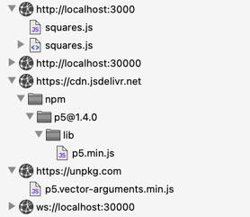
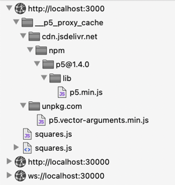

# Proxy Cache

The proxy cache enables “airplane mode”, where the p5-server development server
can used without an internet connection.

It works by caching requests to known Content Delivery Network (CDN) servers, so
that they are served from a local cache instead.

(This feature, or a server that provides this feature, are variously referred to
on the web as a *proxy cache*, a *reverse proxy cache*, a *caching proxy*, or a
*web accelerator*.)

Without the proxy cache:



With the proxy cache:



## How to Use the Cache

The proxy cache is enabled by default. To use it, simply browse your sketches
while your computer is connected the internet. This loads any CDN files that are
necessary to run the sketches that you view. At any later point, you can view
the same sketches without an internet connection.

The `p5 proxy-cache warm` command can also be used to pre-load the cache with
import paths for p5.js and its community libraries, and with the resources that
the p5 server itself uses to display, for example, directory pages, the
split-screen browser, and error pages.

## Disabling the Cache

To run the server without the proxy cache, run the `p5 server` command with the
`--no-proxy-cache` option.

The files created by `p5 build` and `p5 generate` do not reference the CDN
servers directly, and do not depend on the cache. The cache is only used when
running `p5 server`.

## What is Cached?

Requests for NPM packages from the JSDelivr, Skypack, and Unpkg content delivery
networks are cached, as are resources from `fonts.googleapis.com`,
`fonts.gstatic.com`, and `ghcdn.rawgit.org`.

Import paths from the community p5.js libraries are also cached. Most of these
paths are either NPM packages or are served from `ghcdn.rawgit.org`, and would
be cached in any case. A few of the community libraries are served from servers
that are specific to those libraries or the organizations that public them; this
ensures that they are cached as well.

## Command Line

The `p5 proxy-cache` subcommand can be used to inspect and manipulate the cache:

**`p5 proxy-cache clear`** removes all entries from the cache.

**`p5 proxy-cache info`** prints information about the cache.

**`p5 proxy-cache ls`** lists the cache entries.

With the `--json` option, the output can be used with
[jq](https://stedolan.github.io/jq/) to perform queries. For example, list all
the content-types:

```sh
$ p5 proxy-cache ls --json | jq '[.[].headers."content-type"] | unique'
[
  "application/javascript",
  "application/javascript; charset=utf-8",
  "application/vnd.ms-fontobject",
  # etc.
]
```

See section "JSON Recipes" below for additional recipes.

**`p5 proxy-cache path`** prints the path to the cache.

**`p5 proxy-cache warm`** “warms” the cache, by loading it with requests for
p5.js and community libraries.

Many of these commands take options. Use `--help` to see these; for example, `p5
cache ls --help`.

## Implementation Details

The server rewrites HTML and CSS files, as they are served, to load resources
from the server itself instead of from CDN servers. This allows the server to
cache these resources, and to serve them without an internet connection.

In HTML documents, the `src` attributes of `script` elements, and the `href`
attributes of `link` element with a `type="stylesheet"` attribute, are modified.

In CSS documents, URLs that resolve to CDN resources are also rewritten. This
ensures that if the HTML for a sketch links to a CSS document that in turn
includes other CSS documents or other assets (such as fonts or images), these
assets are also cached.

A request for `https://cdn.jsdelivr.net/npm/p5@1.4.0/lib/p5.min.js`, for
example, is rewritten as a request for
`__p5_proxy_cache/cdn.jsdelivr.net/npm/p5@1.4.0/lib/p5.min.js`. A request for
`https://unpkg.com/p5.vector-arguments.min.js` is rewritten as
`__p5_proxy_cache/unpkg.com/p5.vector-arguments.min.js`. This naming scheme was
selected to make the source list of the browser's developer console readable (as
illustrated in the screenshot at the top of this document).

Status codes and response headers are cached. Each step of a redirect is cached.

The server uses npm's [cacache](https://github.com/npm/cacache) to manage the
cache, and [node-html-parser](https://github.com/taoqf/node-fast-html-parser)
and [css-tree](https://github.com/csstree/csstree) to parse and re-generate HTML
and CSS documents.

The cache is stored on disk at `~/.cache/p5-server`.

## Limitations

The proxy cache ignores the [Cache Control
directives](https://developer.mozilla.org/en-US/docs/Web/HTTP/Headers/Cache-Control).
In particular, it caches all CDN content, regardless of the presence of
`no-cache`, `no-store`. `must-revalidate`, `proxy-revalidate`, and
`no-transform`. In practice, the only directives I've observed from cached
requests to the CDN servers, aside from `max-age` and `s-maxage`, are
`immutable`, `public`, and `private`, which don't affect the caching policy.

## Appendix: JSON Recipes

With the `--json` option, the output can be used with
[jq](https://stedolan.github.io/jq/) to perform queries:

```sh
# List all the content-types
$ p5 proxy-cache ls --json | jq '[.[].headers."content-type"] | unique'
[
  "application/javascript",
  "application/javascript; charset=utf-8",
  "application/vnd.ms-fontobject",
  # etc.
]

# List content-types that start with "text/"
$ p5 proxy-cache ls --json | jq '[.[].headers."content-type" | select(startswith("text/"))] | unique'
[
  "text/css; charset=utf-8",
  "text/html; charset=utf-8",
  "text/javascript",
  "text/plain; charset=utf-8"
]

# Display urls together with content-types
$ p5 proxy-cache ls --json | jq '.[] | {originUrl, type: .headers."content-type"}'
{
  "originUrl": "https://cdn.jsdelivr.net/gh/antiboredom/p5.patgrad/p5.patgrad.min.js",
  "type": "application/javascript; charset=utf-8"
}
{
  "originUrl": "https://cdn.jsdelivr.net/gh/highlightjs/cdn-release@11.2.0/build/highlight.min.js",
  "type": "application/javascript; charset=utf-8"
}
# etc.

# Display entries that are not gzipped
$ p5 proxy-cache ls --json | jq '.[] | select(.headers."content-encoding" != "gzip").originUrl'
"https://cdn.jsdelivr.net/npm/semantic-ui@2.4/dist/themes/default/assets/fonts/brand-icons.woff"
"https://cdn.jsdelivr.net/npm/semantic-ui@2.4/dist/themes/default/assets/fonts/brand-icons.woff2"
# etc.
```
