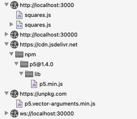
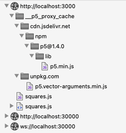

# Proxy Cache

The proxy cache lets the p5-server development server run without an internet
connection after its resources have been cached.

It stores requests to known content delivery networks (CDNs) and serves later
requests from a local cache.

This feature is also called a *reverse proxy cache*, *caching proxy*, or *web
accelerator*.

Without the proxy cache:



With the proxy cache:



## How to Use the Cache

The proxy cache is enabled by default. Browse sketches while connected to the
internet to cache the CDN resources they use. You can then view the same
sketches without an internet connection.

The `p5 proxy-cache warm` command preloads resources for p5.js, community
libraries, directory pages, the split-screen browser, and error pages.

## Disabling the Cache

To run the server without the proxy cache, run the `p5 serve` command with the
`--no-proxy-cache` option.

The files created by `p5 build` and `p5 create` reference the CDN servers
directly, and do not depend on the cache. The cache is only used when
running `p5 serve`.

## What is Cached?

Requests for npm packages from jsDelivr, Skypack, and unpkg content delivery
networks are cached, as are resources from `fonts.googleapis.com` and
`fonts.gstatic.com`.

Import paths from community p5.js libraries are also cached. Most are already
served by a recognized CDN. The explicit list also covers libraries hosted on
their own project or organization servers.

## Command Line

The `p5 proxy-cache` subcommand can be used to inspect and manipulate the cache:

**`p5 proxy-cache clear`** removes all entries from the cache.

**`p5 proxy-cache info`** prints information about the cache.

**`p5 proxy-cache ls`** lists the cache entries.

With the `--json` option, the output can be used with
[jq](https://stedolan.github.io/jq/) to perform queries. For example, list all
the content-types:

```sh
$ p5 proxy-cache ls --json | jq '[.[].headers."content-type"] | unique'
[
  "application/javascript",
  "application/javascript; charset=utf-8",
  "application/vnd.ms-fontobject",
  # etc.
]
```

See [JSON Recipes](#appendix-json-recipes) for more examples.

**`p5 proxy-cache path`** prints the path to the cache.

**`p5 proxy-cache warm`** loads resources for p5.js and community libraries into
the cache.

Many of these commands take options. Run `p5 proxy-cache ls --help` for an
example.

## Implementation Details

As it serves HTML and CSS files, the server rewrites CDN URLs to pass through
the local proxy. The proxy can then cache and serve those resources offline.

In HTML documents, the proxy modifies `src` attributes on `script` elements and
`href` attributes on stylesheet `link` elements.

In CSS documents, URLs that resolve to CDN resources are also rewritten. This
ensures that if the HTML for a sketch links to a CSS document that in turn
includes other CSS documents or other assets (such as fonts or images), these
assets are also cached.

A request for `https://cdn.jsdelivr.net/npm/p5@2.3/lib/p5.min.js`, for
example, is rewritten as a request for
`__p5_proxy_cache/cdn.jsdelivr.net/npm/p5@2.3/lib/p5.min.js`. A request for
`https://unpkg.com/p5.vector-arguments.min.js` is rewritten as
`__p5_proxy_cache/unpkg.com/p5.vector-arguments.min.js`. This naming scheme was
selected to keep the browser developer console's source list readable, as shown
in the opening screenshots.

Status codes and response headers are cached. Each step of a redirect is cached.

The server uses [cdn-proxy-cache](https://github.com/osteele/cdn-proxy-cache),
which stores content with [cacache](https://github.com/npm/cacache) and rewrites
HTML and CSS with node-html-parser and css-tree.

Run `p5 proxy-cache path` to display the platform-specific cache directory.

## Limitations

The proxy cache honors important [Cache-Control
directives](https://developer.mozilla.org/en-US/docs/Web/HTTP/Headers/Cache-Control).
It does not store responses marked `no-store` or `private`, and it re-fetches
`no-cache` and expired `must-revalidate` responses before serving them. Other
expired entries are served immediately while they refresh in the background.

## Appendix: JSON Recipes

With the `--json` option, the output can be used with
[jq](https://stedolan.github.io/jq/) to perform queries:

```sh
# List all the content-types
$ p5 proxy-cache ls --json | jq '[.[].headers."content-type"] | unique | .[]'
"application/javascript",
"application/javascript; charset=utf-8",
"application/vnd.ms-fontobject",
# etc.

# List content-types that start with "text/"
$ p5 proxy-cache ls --json | jq '[.[].headers."content-type" | select(startswith("text/"))] | unique | .[]'
"text/css; charset=utf-8",
"text/html; charset=utf-8",
"text/javascript",
"text/plain; charset=utf-8"
# etc.

# Display urls together with content-types
$ p5 proxy-cache ls --json | jq '.[] | {originUrl, type: .headers."content-type"}'
{
  "originUrl": "https://cdn.jsdelivr.net/gh/antiboredom/p5.patgrad/p5.patgrad.min.js",
  "type": "application/javascript; charset=utf-8"
}
{
  "originUrl": "https://cdn.jsdelivr.net/gh/highlightjs/cdn-release@11.2.0/build/highlight.min.js",
  "type": "application/javascript; charset=utf-8"
}
# etc.

# List the urls of CSS documents
$ p5 proxy-cache list --json | jq '[.[] | select(.headers."content-type" | startswith("text/css")) | .originUrl] | unique | .[]'
"https://cdn.jsdelivr.net/gh/highlightjs/cdn-release@11.2.0/build/styles/default.min.css"
"https://cdn.jsdelivr.net/gh/highlightjs/cdn-release@11.2.0/build/styles/github-dark.min.css"
"https://cdn.jsdelivr.net/npm/semantic-ui@2.4/dist/semantic.min.css"
"https://fonts.googleapis.com/css?family=Lato:400,700,400italic,700italic&subset=latin"

# Display entries that are not gzipped
$ p5 proxy-cache ls --json | jq '.[] | select(.headers."content-encoding" != "gzip").originUrl'
"https://cdn.jsdelivr.net/npm/semantic-ui@2.4/dist/themes/default/assets/fonts/brand-icons.woff"
"https://cdn.jsdelivr.net/npm/semantic-ui@2.4/dist/themes/default/assets/fonts/brand-icons.woff2"
# etc.
```

## References

- [MDN: HTTP Headers](https://developer.mozilla.org/en-US/docs/Web/HTTP/Headers)
- [MDN: Proxy Server](https://developer.mozilla.org/en-US/docs/Glossary/Proxy_server)
